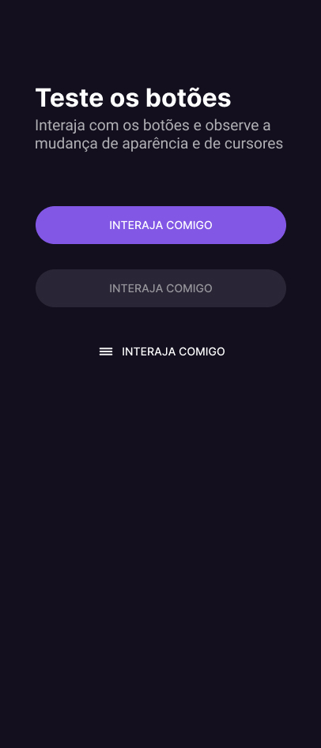

<h1 align="center"> Desafio 03 #boraCodar - Rocketseat  </h1>

 
 
    <a href="#-acesso-ao-projeto">Acesso ao projeto</a>&nbsp;&nbsp;&nbsp;|&nbsp;&nbsp;&nbsp; 
    <a href="#-tecnologias-utilizadas">Tecnologias utilizadas</a>&nbsp;&nbsp;&nbsp;|&nbsp;&nbsp;&nbsp;
    <a href="#-preview">Preview</a>&nbsp;&nbsp;&nbsp;|&nbsp;&nbsp;&nbsp;  
    <a href="#-links">Links</a> 
  

  
  
 
    
 
 
  
  
  
  ## 🖼️ Preview
  
  <h1 align="center">
  
  </h1>
  
  ## 📁 Acesso ao projeto
  
  Você pode acessar o [PROJETO](https://github.com/carlosalbertojusto/bora-codar-03-botoes).
  
  ## ✔️ Tecnologias Utilizadas
  
 - HTML
 - CSS
 - Git
 - Figma

## 🧾 Resumo do projeto

Desafio 03 #boraCodar da Rocketseat - Preview de um produto de uma Loja.

Live site URL : [Desafio 03 #boraCodar - Rocketseat ](https://carlosalbertojusto.github.io/bora-codar-03-botoes/)

## 🔖 Layout

Você pode visualizar o layout do projeto através [DESSE LINK](https://www.figma.com/community/file/1197534710257750520). É necessário ter conta no [Figma](https://figma.com) para acessá-lo.
